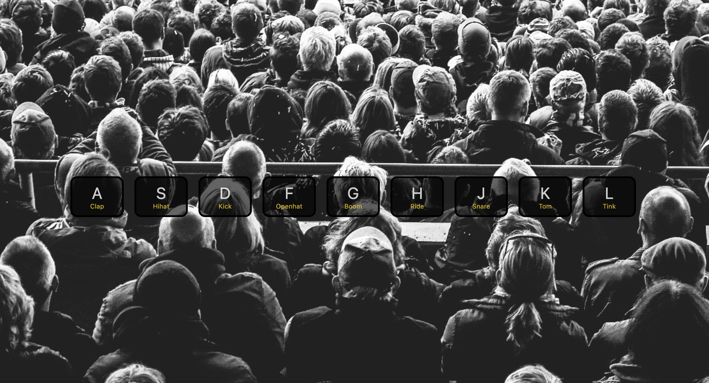

# JavaSrcipt Drum Kit

## Overview

Make funky sounds by pressing some keys on your keyboard.

## Screenshot

### Links

- [See live site here](https://thomaserdmenger.github.io/JavaScript-Drum-Kit/)
- [GitHub Repository](https://github.com/thomaserdmenger/JavaScript-Drum-Kit)
- [GitHub Author](https://github.com/thomaserdmenger)
